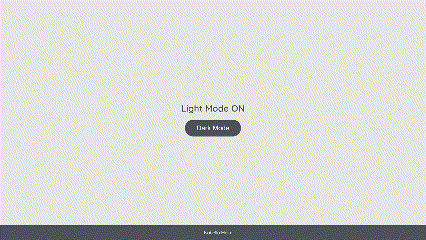
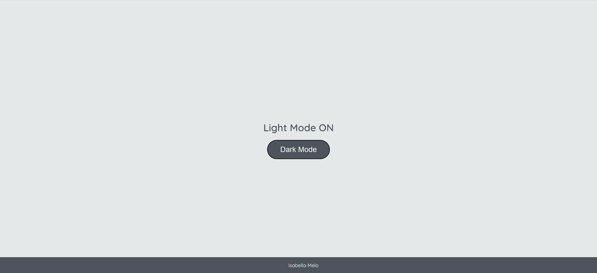
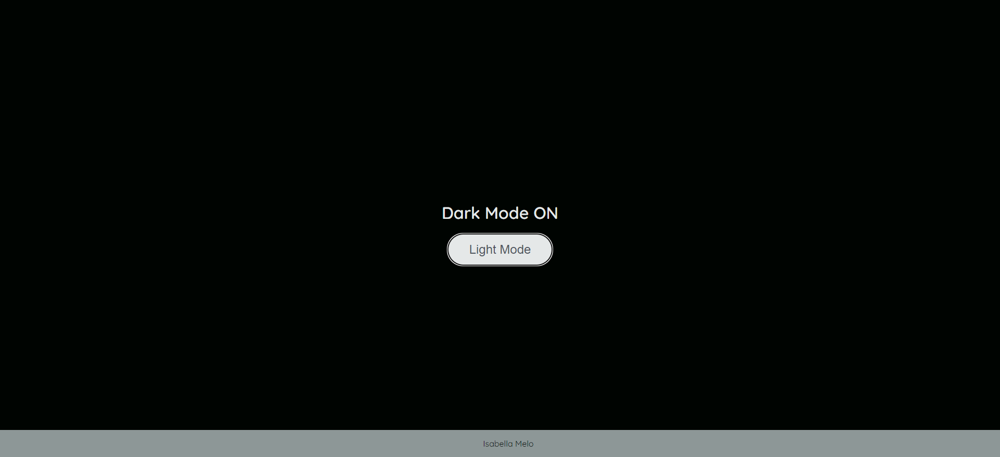

# Projeto Light Mode/Dark Mode 
Projeto desenvolvido no basecamp de Javascript, na plataforma DIO, cujo objetivo é a manipulação do DOM para construir uma página simples que tenha modo noturno.

<a href="https://isabellacpmelo.github.io/dark-mode/"> 

## Ferramentas utilizadas:
- HTML5
- CSS3
- Javascript

## Print do Projeto

### Light Mode

### Dark Mode

